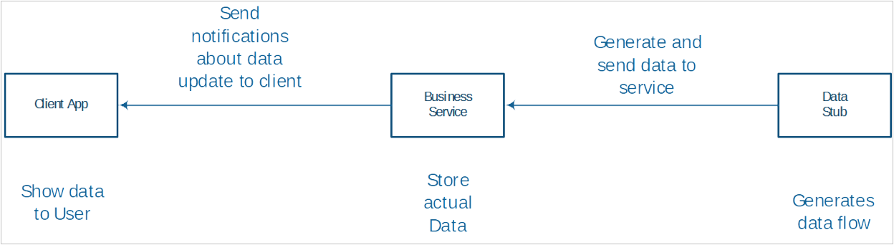

## Тестовое задание

Из внешнего источника данных система получает обновления сущностей.

Сущность выглядит следующим образом:

| **Поле**        | **Тип**                         |
| --------------- | ------------------------------- |
| **ID**          | String                          |
| **Параметр 1**  | Double в промежутке от -1 до +1 |
| **Параметр 2**  | Double в промежутке от -1 до +1 |
| **Параметр 3**  | Double в промежутке от -1 до +1 |
| …               | Double в промежутке от -1 до +1 |
| …               | Double в промежутке от -1 до +1 |
| **Параметр 20** | Double в промежутке от -1 до +1 |

Сущности отправляются в нашу систему в случайной последовательности с частотой 10 сообщений в секунду. Например: Entity1, Entity2, Entity3, Entity4…. Entity1, Entity3, Entity2, Entity4…. Уникальных сущностей 20. Значения параметров меняются в любой момент.

В некоторый период времени мы можем не получать обновлений (внешний сервис выключен).

Наша система состоит из сервиса, который слушает обновление данных и хранит их (способ хранения текущих значений любой - БД, структуры в памяти, файлы на диске и т.п.) и сервиса который может отдать одну сущность или список всех сущностей в актуальном состоянии (последнее состояние, полученное из внешнего источника). сервис хостится любым способом (консольное приложение, Windows сервис, IIS и т.д.).

Клиентское приложение отображает список сущностей и их параметров:

| name    | param1 | param2  | param3  | param4 | param5 | param6  | param7  | param8  | param9  |
| ------- | ------ | ------- | ------- | ------ | ------ | ------- | ------- | ------- | ------- |
| Entity1 | 0,1000 | 0,2000  | 0,3070  | 0,4011 | 0,5055 | -0,1004 | -0,2044 | -0,3044 | -0,0577 |
| Entity2 | 0,7500 | -0,2200 | -0,3270 | 0,4110 | 0,5555 | -0,1231 | -0,2444 | -0,3434 | -0,5777 |
| Entity3 | 0,1000 | 0,2000  | 0,3030  | 0,4110 | 0,5555 | -0,1789 | -0,2444 | -0,3322 | -0,5777 |
| Entity4 | 0,1000 | 0,0200  | 0,3198  | 0,2410 | 0,5555 | -0,1232 | -0,2444 | -0,3454 | -0,7685 |
| Entity5 | 0,1000 | 0,0200  | 0,3254  | 0,6401 | 0,5123 | -0,1543 | -0,2444 | -0,3434 | -0,5373 |
| Entity6 | 0,1000 | 0,0020  | 0,3345  | 0,4401 | 0,5321 | -0,1576 | -0,2444 | -0,3543 | -0,5452 |
| Entity7 | 0,1000 | 0,0002  | 0,3111  | 0,4501 | 0,5454 | -0,1234 | -0,2444 | -0,3767 | -0,5222 |
| ИТОГО:  |

В строке ИТОГО должна быть возможность для каждой колонки (параметр) выбрать тип агрегации (sum, min, max, avg) и отобразить результат операции. По умолчанию Sum.

Фон ячеек для параметров сущностей

- в промежутке [-1;0) задается как rgba(255, 140, 0, abs(value))
- для значения 0 задается как rgb(255, 255, 255)
- в промежутке (0;1) задается как rgba(0, 0, 0, abs(value))

Текст должен быть контрастным по отношению к фону и хорошо читаться.

Нужна заглушка (в тестовых целях) имитирующая внешний источник данных по отношению к нашей системе.

С течением времени данные на клиенте обновляются (асинхронные вызовы, таймер, очередь сообщений – на выбор). Может быть запущено несколько клиентов одновременно.

